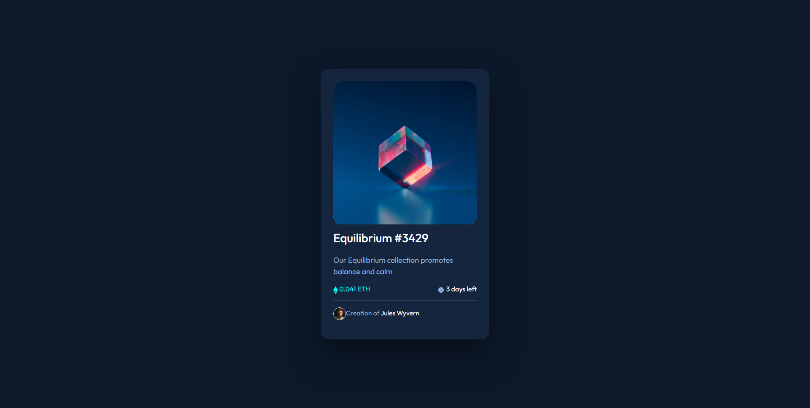

# Frontend Mentor - NFT preview card component solution

This is a solution to the [NFT preview card component challenge on Frontend Mentor](https://www.frontendmentor.io/challenges/nft-preview-card-component-SbdUL_w0U). Frontend Mentor challenges help you improve your coding skills by building realistic projects.

## Table of contents

- [Overview](#overview)
  - [The challenge](#the-challenge)
  - [Screenshot](#screenshot)
  - [Links](#links)
- [My process](#my-process)
  - [Built with](#built-with)
  - [Useful resources](#useful-resources)
- [Author](#author)

## Overview

### The challenge

Users should be able to:

- View the optimal layout depending on their device's screen size
- See hover states for interactive elements

### Screenshot

### Links

- Solution URL: [Add solution URL here](https://your-solution-url.com)
- Live Site URL: [Add live site URL here](https://your-live-site-url.com)

## My process

- I started with installing Bootstrap.
- added basic HTML
- styled it with CSS and Bootstrap classes

### Built with

- Semantic HTML5 markup
- CSS custom properties
- Bootstrap v5

### Useful resources

- [Bootstrap sizes](https://getbootstrap.com/docs/5.0/utilities/sizing/) - This helped me set container 100% vertical height with "vh-100" class, and center content in the middle of the page.  

## Author

- CodePen - [SzymonK](https://codepen.io/SzymonK)
- Frontend Mentor - [@SzymonKap](https://www.frontendmentor.io/profile/SzymonKap)
